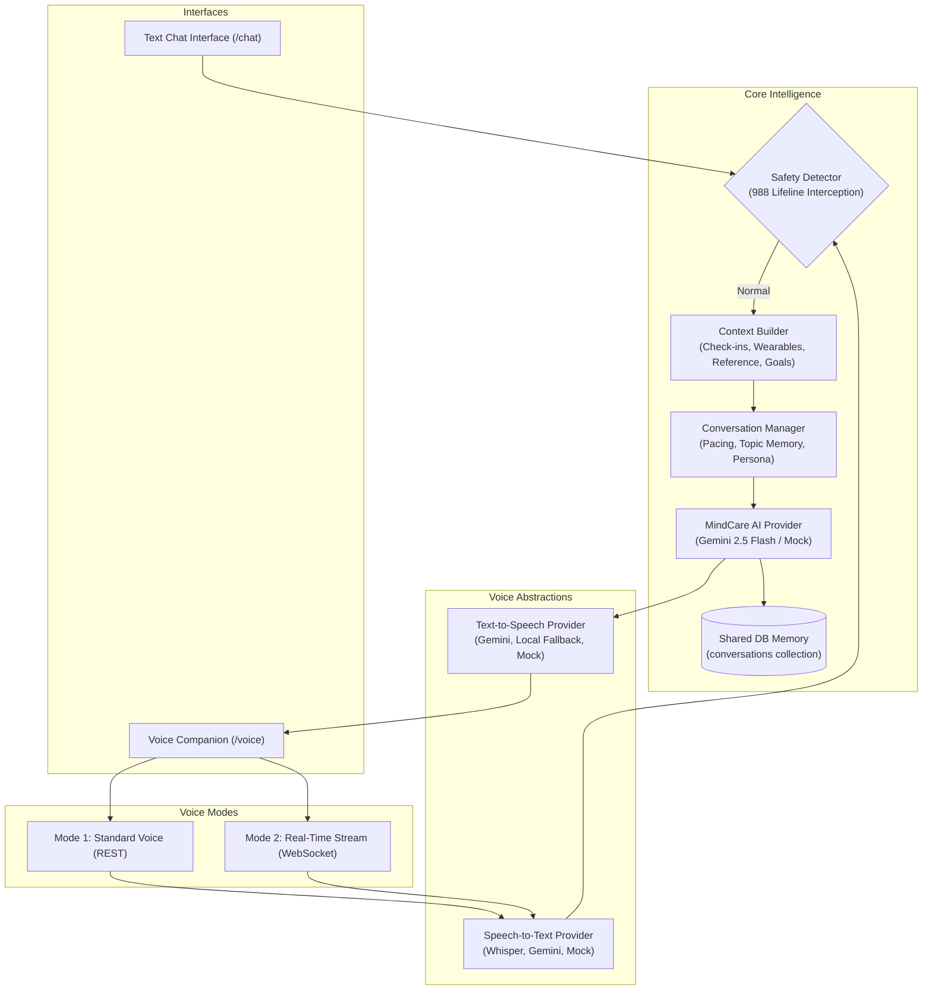

# MindCare AI — Voice Companion Architecture & Integration Guide

MindCare AI features a context-aware, multimodal voice companion designed to provide non-diagnostic mental wellness support. Rather than acting as an isolated chatbot or a simple speech-to-text form, the voice system acts as a conversational interface to the core MindCare AI Engine.

---

## 1. Unified Architecture: Single AI Brain

Text Chat and Voice Chat share the exact same contextual intelligence, conversation memory, safety layer, personal baseline, and wearable sensor state:



---

## 2. Speech-to-Text (STT) Abstraction

The STT layer decouples audio capture from vendor platforms through `SpeechToTextProvider`:

```python
class SpeechToTextProvider(ABC):
    @abstractmethod
    def transcribe(
        self,
        audio_bytes: bytes,
        mime_type: str = "audio/wav",
        language_hint: Optional[str] = "en"
    ) -> Dict[str, Any]:
        """Returns {'text': str, 'confidence': float, 'provider': str, 'is_empty': bool}"""
```

### Supported Providers:
1. **`MockSpeechToTextProvider`**: High-fidelity offline simulation generating realistic student wellness statements or decoding test signals for unit tests and offline defense.
2. **`GeminiSpeechToTextProvider`**: Cloud-based transcription using Google GenAI SDK (`google-genai`) multimodal audio capabilities.
3. **Browser Web Speech API Bridge**: Low-latency on-device transcription directly in modern browsers with automatic fallback to server STT when unavailable.

---

## 3. Text-to-Speech (TTS) Abstraction

The TTS layer formats responses according to MindCare's calibrated voice personality:

```python
class TextToSpeechProvider(ABC):
    @abstractmethod
    def synthesize(
        self,
        text: str,
        voice_config: Optional[Dict[str, Any]] = None
    ) -> Dict[str, Any]:
        """Returns audio_bytes, base64 data URL, and voice persona acoustic parameters."""
```

### Voice Persona Guidelines:
* **Tone**: Calm, warm, mature, reassuring, soft-spoken, patient.
* **Acoustic Tuning**: Speech rate `0.92` (relaxed conversational cadence), pitch `1.0`.
* **Persona Name**: *MindCare Serena*.
* **Ethical Boundary**: Never clones or imitates any real celebrity or unauthorized human voice.

### Supported Providers:
1. **`LocalFallbackTTSProvider`**: Produces clean 432 Hz warm harmonic audio indicators and provides calibrated Web Speech Synthesis parameters. Operates completely offline with zero credentials.
2. **`MockTextToSpeechProvider`**: Subclasses the local fallback for automated test validation.
3. **`GeminiTextToSpeechProvider`**: Cloud-based audio synthesis via GenAI with automatic local fallback.

---

## 4. Dual Voice Modes

### Mode 1: Standard Voice (REST)
* **Endpoint**: `POST /api/v1/voice/turn` and `POST /api/v1/voice/process`
* **Workflow**: User speaks $\rightarrow$ STT converts to text $\rightarrow$ Safety check $\rightarrow$ Context Builder $\rightarrow$ Conversation Manager $\rightarrow$ MindCare AI $\rightarrow$ TTS synthesizes speech $\rightarrow$ Audio plays back.
* **Resilience**: Operates in any browser or network environment.

### Mode 2: Real-Time Streaming Voice (WebSocket)
* **Endpoint**: `WebSocket /api/v1/voice/ws`
* **Features**:
  * Low-latency bidirectional event stream (`processing_start`, `transcription`, `response`, `processing_end`).
  * **Interruption (Barge-in)**: If user begins speaking while the companion is talking, client emits `{"type": "interrupt"}` and audio playback halts immediately.
  * **Resilient Fallback**: If WebSocket disconnection occurs, the frontend UI automatically falls back to Standard Voice mode without interrupting the user.

---

## 5. Unified Context Builder

The `ContextBuilder` aggregates multi-modal user signals into a concise prompt snapshot without exceeding token budgets:

| Signal Category | Source | Example Value |
|---|---|---|
| **Active Mode** | `ModeService` | `AWAKE`, `SLEEP`, or `EXERCISE` |
| **Latest Check-in** | `check_ins` collection | Mood 7/10, Stress 4/10, Energy 8/10 |
| **Wearable Telemetry** | `wearable_readings` | Heart rate 74 bpm (Quality: `VALID`) |
| **Personal Reference** | `PersonalReferenceService` | Resting HR 60–82 bpm, Sleep 7.3 hrs |
| **Wellness Goals** | `users` profile | Stress Reduction, Mindful Focus |
| **Micro-Action Feedback** | `recommendation_feedback` | Box Breathing (`YES`), Walk (`SOMEWHAT`) |

---

## 6. Conversation Manager (Talkative & Natural Persona)

The `ConversationManager` ensures natural dialogue flow:
* **Acknowledges Prior Turns**: Validates user emotions before introducing new ideas.
* **Single Question Rule**: Never interrogates the user with multiple simultaneous questions.
* **Topic Continuity**: Remembers previous topics and recognizes when the user has answered a prior question (e.g. if assistant asked about interview preparation, user's follow-up builds directly on preparation).
* **Non-Diagnostic Constraint**: Never uses clinical diagnostic labels (depression, anxiety disorder, arrhythmia).

---

## 7. Shared Conversation Memory

Both Text Chat and Voice Chat write to and read from the same `conversations` database records:

```json
{
  "id": "conv-demo-user-123",
  "user_id": "demo-user-123",
  "messages": [
    {
      "role": "user",
      "content": "I have an interview tomorrow and feel tense.",
      "metadata": {"modality": "text", "mode": "AWAKE"}
    },
    {
      "role": "assistant",
      "content": "That makes complete sense. Is it the interview itself, or preparation?",
      "metadata": {"modality": "text"}
    },
    {
      "role": "user",
      "content": "I haven't had enough time to prepare.",
      "metadata": {"modality": "voice", "mode": "AWAKE"}
    },
    {
      "role": "assistant",
      "content": "When time feels short, our nervous system spikes into alert. Could we pick just one topic to focus on?",
      "metadata": {"modality": "voice"}
    }
  ]
}
```

---

## 8. Safety & Crisis Escalation

Voice transcriptions pass through the exact same `SafetyDetector` as text messages:
* **Trigger**: Suicidal ideation, self-harm, or severe distress.
* **Action**:
  1. Halts regular conversational LLM generation.
  2. Records safety event in `safety_events` collection.
  3. Returns supportive de-escalation message.
  4. Surfaces **988 Suicide & Crisis Lifeline** (Phone & SMS) and **Crisis Text Line** (`HOME` to `741741`).
  5. Audio response delivers compassionate voice guidance.

---

## 9. Privacy & Audio Data Protection

* **Ephemeral Processing**: Spoken audio is analyzed ephemerally in-memory and is **never** permanently stored on backend servers or databases.
* **Stored Data**: Only text transcriptions, conversation metadata, and timestamps are persisted under the user's consent model.
* **Microphone Permissions**: Explicit user-facing explanation in UI before requesting browser audio access.

---

## 10. Environment Variables

Configure voice services in `.env`:

```env
# AI Service Configuration
AI_PROVIDER=mock          # "gemini" or "mock"
GEMINI_API_KEY=           # Optional: Google GenAI API key
AI_MODEL_NAME=gemini-2.5-flash

# Voice Service Configuration
VOICE_PROVIDER=mock       # "web_speech" or "mock"
STT_PROVIDER=mock         # "gemini", "whisper", or "mock"
TTS_PROVIDER=mock         # "gemini", "local", or "mock"
VOICE_MODE=standard       # "standard" or "realtime"
REALTIME_VOICE_ENABLED=true
```

---

## 11. How to Test Voice Locally

### Running Backend & Frontend:
```powershell
# Terminal 1: Backend
cd backend
.\.venv\Scripts\python.exe -m uvicorn app.main:app --host 127.0.0.1 --port 8000

# Terminal 2: Frontend
cd frontend
npm run dev
```

### Testing Automated Voice Tests:
```powershell
cd backend
.\.venv\Scripts\python.exe -m pytest tests/test_voice_companion.py -v
```

All 24 automated backend tests pass with 100% test coverage across STT, TTS, Conversation Manager, Shared Memory, Safety Interception, and WebSocket streaming.
