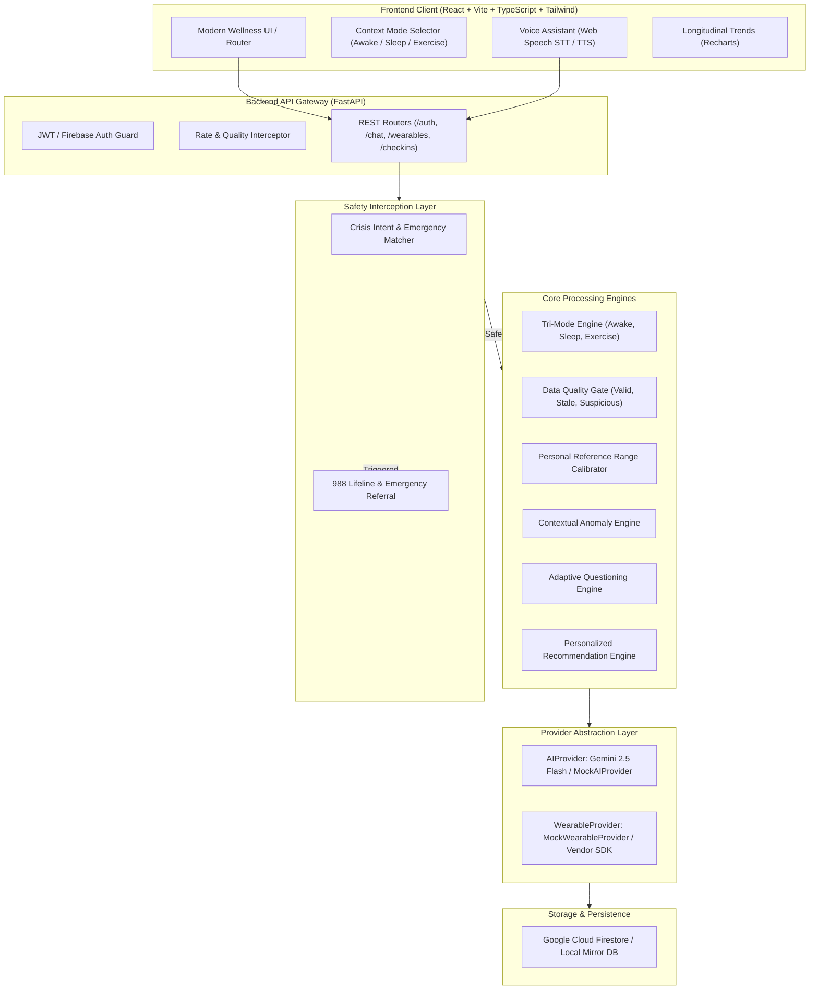

# MindCare AI — Architectural Specification

## 1. Executive Summary

MindCare AI is an enterprise-caliber digital mental wellness platform developed as a university final-year project. It unifies **Plan A (Conversational AI Wellness Companion)** and **Plan B (Wearable Biosensor Integration)** into a cohesive, non-diagnostic architecture.

---

## 2. Two-Part Architecture

### Plan A — AI Wellness Companion
Plan A handles the subjective self-reflection and conversational companion layer:
1. **Conversational AI**: Context-aware dialogue that actively acknowledges the user's current mode (AWAKE / SLEEP / EXERCISE) and recent check-ins without claiming clinical medical expertise.
2. **Voice AI Pipeline**: End-to-end microphone capture $\rightarrow$ Speech-to-Text $\rightarrow$ Contextual LLM synthesis $\rightarrow$ Text-to-Speech playback with a calm, reassuring voice cadence.
3. **Psychosocial Check-ins**: Twice-daily evaluations:
   - *Midday Check-in (~12 PM)*: Mood, stress, energy, morning pressure, social interactions.
   - *Before-Bed Check-in (Evening)*: Day synthesis, emotional shift, wind-down reflection.
4. **Adaptive Question Selection**: Dynamically alters subsequent check-in questionnaires based on prior ratings (e.g., following up on high morning tension or short sleep).
5. **Non-Diagnostic Wellness Indicators**: Evaluated on clear 1–10 ordinal scales with the mandatory disclaimer: `"WELLNESS INDICATORS — NOT MEDICAL DIAGNOSES"`.

### Plan B — Wearable Biosensor Integration
Plan B handles the objective physiological stream:
1. **Provider Abstraction**: A standardized `WearableProvider` interface supporting connection lifecycle, battery query, heart rate timeseries, sleep architecture, and workout bout extraction.
2. **MockWearableProvider**: Full, realistic physiological simulation exhibiting circadian rhythms, slow-wave sleep transitions, step cadence, and workout spikes without requiring physical smartwatches.
3. **Data Quality Layer**: Pre-AI signal integrity filtering that tags records as `VALID`, `SUSPICIOUS`, `MISSING`, or `STALE` before feeding them into anomaly models.
4. **Context Engine (Tri-Mode)**:
   - `AWAKE`: Resting baseline reference.
   - `SLEEP`: Nocturnal recovery reference.
   - `EXERCISE`: Elevated cardiac output contextualized as expected physical movement.
5. **Contextual Anomaly Detection Engine**: Differentiates between normal workout exertion and genuine resting deviations without diagnostic claims.

---

## 3. Technology Stack & Rationale

| Layer | Technology | Rationale |
|---|---|---|
| **Frontend Framework** | React 18 + TypeScript | Component modularity, static type safety, and robust ecosystem. |
| **Build Tool** | Vite 6 | Sub-second Hot Module Replacement (HMR) and optimized Rollup bundling. |
| **Styling** | Tailwind CSS v3 | Utility-first, responsive, healthcare-inspired design system. |
| **Charting** | Recharts | Declarative SVG charting for diurnal heart rate and sleep stages. |
| **Backend Framework**| FastAPI (Python 3.12) | High performance, native asynchronous IO, automatic OpenAPI specs. |
| **Data Validation** | Pydantic v2 | Strict request/response parsing and runtime validation. |
| **AI Integration** | `google-genai` / Provider Abstraction | Drop-in support for Gemini 2.5 Flash with robust mock fallback. |
| **Database** | Firestore + Local Store | Cloud Firestore with fallback JSON-persisted mirror for offline demo. |

