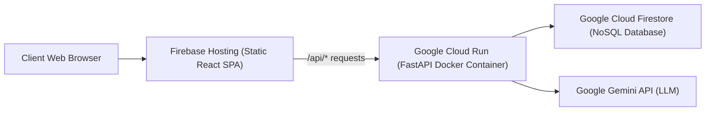

# MindCare AI — Deployment & Cloud Infrastructure Guide

## 1. Local Development Run (Zero External Setup)

MindCare AI can run entirely locally without physical smartwatches or paid cloud APIs.

### Prerequisites:
- Python 3.12+ (or UV package manager)
- Node.js 18+ and npm 10+

### Step 1: Backend Server
```powershell
cd backend
.\.venv\Scripts\python.exe -m uvicorn app.main:app --host 127.0.0.1 --port 8000 --reload
```
API Documentation will be live at: `http://127.0.0.1:8000/docs`.

### Step 2: Frontend Client
```powershell
cd frontend
npm run dev
```
Web application will be live at: `http://localhost:5173`.

---

## 2. Docker & Containerized Deployment

A single `docker-compose.yml` orchestrates both backend and frontend:

```powershell
# Build and run containers
docker-compose up --build -d

# View service logs
docker-compose logs -f
```

- Frontend: `http://localhost:5173`
- Backend API: `http://localhost:8000`

---

## 3. Google Cloud Platform & Firebase Production Deployment



### 1. Deploy Frontend to Firebase Hosting
```powershell
cd frontend
npm run build
cd ..
firebase deploy --only hosting
```

### 2. Deploy Backend to Google Cloud Run
```powershell
cd backend
gcloud run deploy mindcare-backend \
  --source . \
  --region us-central1 \
  --allow-unauthenticated \
  --set-env-vars AI_PROVIDER=gemini,GEMINI_API_KEY="your-key"
```

### 3. Deploy Firestore Rules
```powershell
firebase deploy --only firestore:rules,firestore:indexes
```

